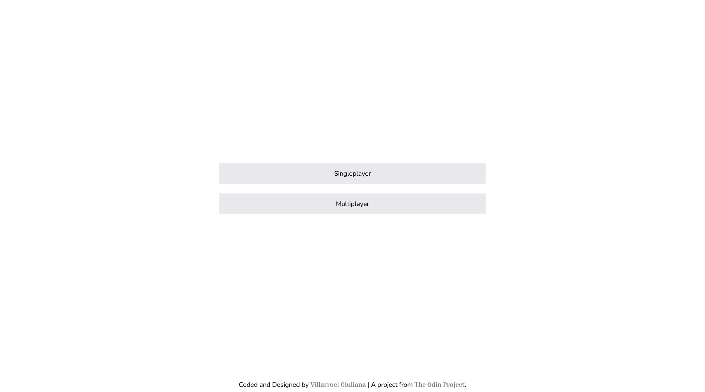
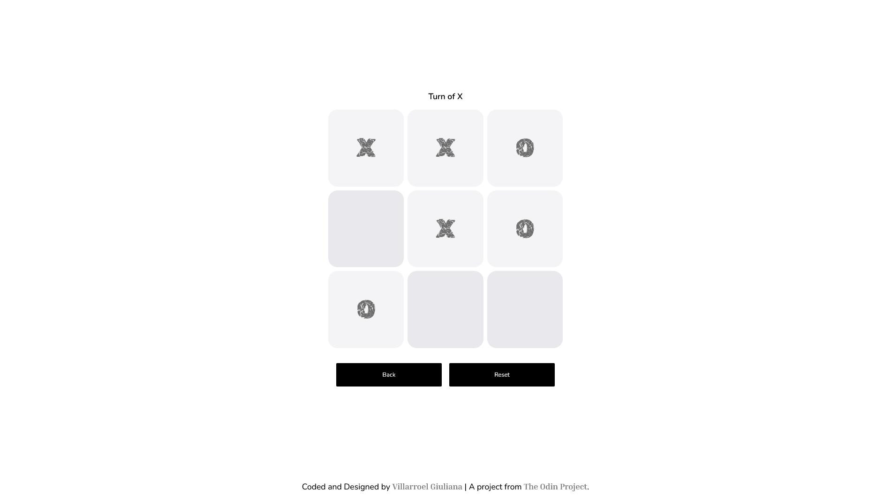

# 🎮 Tic-Tac-Toe Game

[](https://opensource.org/licenses/MIT)

A classic Tic-Tac-Toe game with single-player and multiplayer modes. Built with vanilla JavaScript using Module Pattern and IIFE design patterns as part of [The Odin Project](https://www.theodinproject.com) curriculum.




## ✨ Features

- **Two Game Modes**:
    - 🤖 **Singleplayer**: Play against an AI bot
    - 👥 **Multiplayer**: Play with a friend locally
- **Best of 3 Rounds**: First to win 2 rounds wins the match
- **Live Score Tracking**: Real-time scoreboard showing X and O wins
- **Bot Opponent**: Bot makes random valid moves
- **Round Transitions**: Automatic board reset between rounds
- **Turn Indicators**: Clear display of whose turn it is
- **Responsive Design**: Works seamlessly on desktop and mobile devices
- **Game State Management**: Proper handling of ongoing games, round endings, and match completion

## 🚀 Demo

[Live Demo Link](https://gvillarroel-dev.github.io/tic-tac-toe-js/)

## 🛠️ Technologies Used

- **HTML5**: Semantic markup
- **CSS3**: Custom properties, Flexbox, Grid
- **JavaScript (ES6+)**:
    - Module Pattern (IIFE)
    - Factory Functions
    - Dependency Injection
    - DOM manipulation

## 📂 Project Structure

```
tic-tac-toe/
├── index.html          # Main HTML structure
├── css/
│   └── styles.css      # All styling and responsive design
├── js/
│   └── script.js       # Game logic with Module Pattern
├── img/
|   ├── tictactoe-preview.png # Preview setup image
│   └── tictactoe-preview2.png # Preview board game image
├── README.md
└── LICENSE
```

## 💻 How It Works

### Architecture

The application follows the **Module Pattern** for proper encapsulation and separation of concerns:

1. **Board Module** (`Board`)

```javascript
const Board = (function () {
	let cells = Array(9).fill(null);
	// Manages board state and cell operations
})();
```

- Maintains the 3x3 grid state
- Validates moves and cell availability
- Provides methods to place marks and reset the board

2. **GameRules Module** (`GameRules`)

```javascript
   const GameRules = (function () {
       const WIN_PATTERNS = [...];
       // Determines game outcomes
   })();
```

- Checks for winning combinations
- Detects tie conditions
- Returns current game status

3. **GameController Module** (`GameController`)

```javascript
   const GameController = (function (deps) {
       // Orchestrates game flow with dependency injection
   })({ board: {...}, rules: {...} });
```

- Manages game state and player turns
- Handles round and match logic
- Implements best-of-3 system
- Coordinates player and bot moves

4. **UIElements Module** (`UIElements`)

```javascript
const UIElements = (function () {
	// Creates DOM elements
})();
```

- Separates DOM creation from display logic
- Returns structured element objects

5. **DisplayController Module** (`DisplayController`)

```javascript
const DisplayController = (function () {
	// Manages UI updates and user interactions
})();
```

- Handles all user interactions
- Updates the UI based on game state
- Manages bot move timing and animations

### Factory Functions

- **Player Factory**: Creates human player objects
- **Bot Factory**: Creates AI player with `chooseMove()` method

### Core Functionality

1. **Game Initialization**
    - User selects game mode (singleplayer/multiplayer)
    - Board is rendered dynamically
    - First player (X) starts

2. **Turn Management**
    - Human players click cells to make moves
    - Bot automatically plays after human in singleplayer
    - Turn indicator updates in real-time

3. **Round System**
    - Each game consists of up to 3 rounds
    - Winner of previous round plays first in next round
    - Score is tracked across rounds

4. **Win Detection**
    - Checks all 8 possible winning patterns
    - Declares winner or tie
    - Updates score accordingly

5. **Match Completion**
    - After 3 rounds, declares match winner
    - Disables board interaction
    - Allows reset or return to setup

### Key Features Implementation

**Bot Move Delay**

```javascript
setTimeout(() => {
	const botResult = GameController.playBotMove();
	// Executes bot move with 500ms delay for better UX
}, 500);
```

**Processing Lock**

```javascript
let isProcessing = false;
// Prevents user interaction during bot moves and transitions
```

**Round Transitions**

```javascript
setTimeout(() => {
	renderBoardState();
	updateStatus(
		`Round ${state.roundsPlayed + 1} - Turn of ${state.nextPlayer}`,
	);
}, 900);
```

## 🎨 Design Features

- **Custom CSS Variables**: Centralized theming
- **Responsive Grid**: 3x3 game board adapts to screen size
- **Button States**:
    - Default: Available cell
    - Hover: Interactive feedback
    - Disabled: Already played or game over
- **Smooth Transitions**: Turn changes and round transitions
- **Status Updates**: Real-time game state information

## 🚦 Getting Started

1. Clone the repository:

```bash
   git clone https://github.com/gvillarroel-dev/tic-tac-toe-js.git
```

2. Navigate to project directory:

```bash
   cd tic-tac-toe
```

3. Open `index.html` in your browser:

```bash
   open index.html
```

Or use a local server like Live Server in VS Code.

## 📝 Usage

1. **Start a Game**:
    - Choose **Singleplayer** to play against the bot
    - Choose **Multiplayer** to play with a friend

2. **Play**:
    - Click any empty cell to place your mark (X or O)
    - In singleplayer, bot plays automatically after you
    - First to get 3 in a row wins the round

3. **Win the Match**:
    - Win 2 out of 3 rounds to win the match
    - Score is displayed at the end

4. **Controls**:
    - **Reset**: Restart the current game mode
    - **Back**: Return to mode selection

## 🎯 Game Rules

- Players alternate turns placing X or O
- First to get 3 marks in a row (horizontal, vertical, or diagonal) wins the round
- If all 9 cells are filled with no winner, the round is a tie
- Best of 3 rounds determines the match winner
- In case of a 1-1-1 tie across rounds, the match is tied

## 👀 Code Patterns Used

### Module Pattern (IIFE)

Encapsulates related functionality and exposes only necessary methods:

```javascript
const Module = (function () {
	// Private variables and functions
	let privateVar = "secret";

	function privateFunction() {}

	// Public API
	return {
		publicMethod() {},
	};
})();
```

### Factory Pattern

Creates player objects without using `new` keyword:

```javascript
function Player(name, mark) {
	return {
		getName: () => name,
		getMark: () => mark,
		isBot: () => false,
	};
}
```

### Dependency Injection

GameController receives dependencies rather than creating them:

```javascript
const GameController = (function (deps) {
    // Uses deps.board and deps.rules
})({ board: {...}, rules: {...} });
```

## 🔧 Technical Highlights

- **No Global Pollution**: All code wrapped in modules
- **Separation of Concerns**: Each module has single responsibility
- **State Management**: Centralized game state with constants
- **Error Handling**: Validation and error prevention throughout
- **Event Delegation**: Efficient event handling
- **DOM Manipulation**: Dynamic element creation and updates

## 🐛 Known Issues & Fixes

All major bugs have been resolved:

- ✅ Cell interaction after moves
- ✅ Bot auto-play after winning rounds
- ✅ User interference during bot turns
- ✅ Proper state transitions

## 🙏 Credits

- **Project**: Part of [The Odin Project](https://www.theodinproject.com) curriculum
- **Developer**: [Villarroel Giuliana](https://github.com/gvillarroel-dev)
- **Design Patterns**: Module Pattern, Factory Pattern
- **Inspiration**: Classic Tic-Tac-Toe game

## 👩‍💻 Author

**Your Name**

- GitHub: [@gvillarroel-dev](https://github.com/gvillarroel-dev)
- Project: [The Odin Project - Tic-Tac-Toe](https://www.theodinproject.com/lessons/node-path-javascript-tic-tac-toe)

## 📄 License

This project is open source and available under the [MIT License](LICENSE).

---

Made with 🧡 as part of The Odin Project journey
